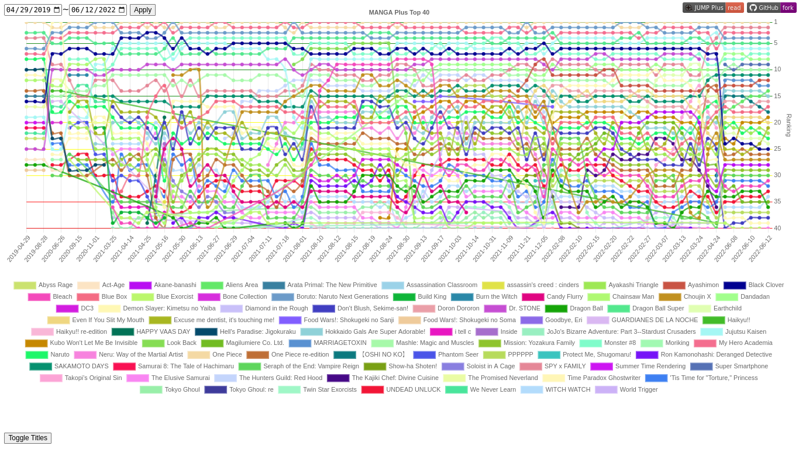

#  MANGA Plus Top 40

The purpose of this project is to extract, archive and show data related to the [MANGA Plus Hottest Manga](https://mangaplus.shueisha.co.jp/manga_list/hot) list.

The original Hottest Manga list only shows the current state of the top 40 manga titles, so there is no history/log or charts. Therefore, this project aims to create a data history and generate an interactive chart of the Hottest Manga list.



## Notice of Non-Affiliation and Disclaimer

This project is not affiliated, associated, authorized, endorsed by, or in any way officially connected with "MANGA Plus by SHUEISHA", SHUEISHA Inc., or any of its subsidiaries or its affiliates. The official MANGA Plus website can be found at https://mangaplus.shueisha.co.jp/.

This project strictly focuses on extracting only the ranking information (manga ranking and titles), no other website resources (such as manga logos and story images) are stored or processed in any way.


## Requirements

Required tools and libraries:

### [Nodejs](https://nodejs.dev/) (for data scraping and processing)

> Tested version: v16.15.1

#### Dependencies:
  - [yarn](https://yarnpkg.com/) (alternative package manager)
  - [puppeteer](https://developers.google.com/web/tools/puppeteer/) (for web scraping)
  - [slugify](https://github.com/simov/slugify) (for title id generation)
  - [js-yaml](https://github.com/nodeca/js-yaml) (for data processing)

Once inside the project directory, install the dependencies by running the following command:
```sh
yarn install
```
or
```sh
npm install
```

### [Sake](https://github.com/williamd1k0/sake) (for webpage processing)

It's a Makefile I created to generate simple static sites.

### [Make](https://www.gnu.org/software/make/) (for tasks)

I like to use Make to write tasks (instead of using nodejs package scripts) because it's simpler and portable.

>NOTE: Make is optional for data scraping and processing, but required for webpage processing.


## Usage

If you just want to see the chart, ignore the following instructions and go here: https://tumeo.space/manga-plus-top40/

Follow the instructions below if you want to run this project locally:

### Scraping ranking data from MANGA Plus website

To scrape new data, stay in the repository root directory and run the following command:
```sh
make today
```
The data will be saved to `scraped-data/YYYY/YYYY-MM-DD.tsv`

>NOTE: This task is performed daily by [GitHub Actions](https://github.com/williamd1k0/manga-plus-top40/actions/workflows/fetch-ranking.yml).

### Processing scraped data

After scraping the data, it needs to be processed to be easily consumable by the website generator.

To process the scraped data, stay in the repository root directory and run the following command:
```sh
make yaml
```
>NOTE: This task is already performed automatically by GitHub Pages Environment.

### Building the chart webpage

The webpage is built only with make, jinja2, fd, yj and jq.

See the site generator project for more info: https://github.com/williamd1k0/sake

The chart library ([Chart.js](https://www.chartjs.org/)) is loaded from a CDN.

To process the webpage, change to the `site` directory and run the following command:

```sh
make
```

>NOTE: This task is already performed automatically by GitHub Pages Environment, see the results here: https://tumeo.space/manga-plus-top40/.
